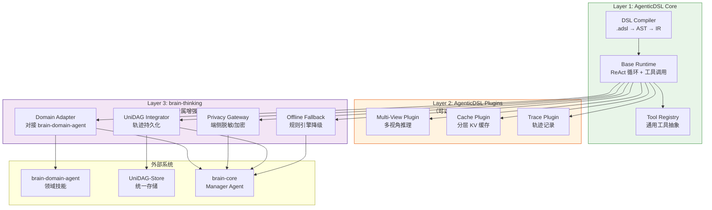

基于对 [AgenticDSL 官方文档](https://deepwiki.com/chisuhua/AgenticDSL ) 的深度研读，结合第二大脑整体架构需求，我提出一套 **"核心-增强-插件"三层协作架构**。此方案既保持 AgenticDSL 的通用生态价值，又满足第二大脑的特殊需求，实现双赢。

---

## 一、现状分析：能力重叠与互补

### 1.1 能力矩阵对比

| 能力维度 | AgenticDSL（当前） | brain-thinking（需求） | 重叠度 | 协作机会 |
|----------|-------------------|------------------------|--------|----------|
| **DSL 编译** | ✅ 完整（.adsl → AST → IR） | ❌ 不需要重复实现 | 高 | 复用编译器 |
| **基础运行时** | ✅ ReAct 循环 + 工具调用 | ✅ 需要但需增强 | 高 | 封装增强 |
| **离线支持** | ❌ 依赖 LLM | ✅ **核心需求** | 无 | brain-thinking 注入规则引擎 |
| **UniDAG 集成** | ❌ 无 | ✅ **核心需求** | 无 | brain-thinking 注入持久化 |
| **隐私保护** | ⚠️ 基础脱敏 | ✅ 端侧加密 + 审计 | 部分 | 增强脱敏网关 |
| **多视角推理** | ❌ 无 | ✅ 预留能力 | 无 | 共同设计扩展点 |
| **跨平台部署** | ✅ 通用 | ✅ 需适配第二大脑 | 高 | 标准化接口 |

> 💡 **核心洞察**：AgenticDSL 已实现 **通用 Agent 编排框架**，但缺失第二大脑必需的 **离线优先、UniDAG 集成、隐私保护** 三大增强能力。

---

## 二、推荐协作架构："核心-增强-插件"三层模型

### 2.1 整体架构图



### 2.2 三层职责划分

| 层级 | 负责方 | 核心职责 | 关键原则 | 演进策略 |
|------|--------|----------|----------|----------|
| **Layer 1<br>AgenticDSL Core** | AgenticDSL 团队 | • DSL 语法设计与编译<br>• 基础 ReAct 运行时<br>• 通用工具抽象 | • 保持通用性（不绑定第二大脑）<br>• 接口契约 5 年稳定 | 独立演进，定期发布 |
| **Layer 2<br>AgenticDSL Plugins** | 双方共建 | • 多视角推理插件<br>• KV 缓存优化插件<br>• 轨迹记录插件 | • 插件化架构（可选启用）<br>• 通用能力（不限于第二大脑） | 社区共建，标准化接口 |
| **Layer 3<br>brain-thinking** | brain-thinking 团队 | • 离线降级（规则引擎）<br>• UniDAG 持久化集成<br>• 隐私保护增强 | • 专注第二大脑特殊需求<br>• 零侵入封装 Core | 与第二大脑同步演进 |

> ✅ **关键原则**：  
> **AgenticDSL Core 保持通用性** → 吸引更广生态  
> **brain-thinking 专注增强** → 满足第二大脑特殊需求  
> **Plugins 作为桥梁** → 共享通用增强能力

---

## 三、具体协作方案

### 3.1 接口契约设计（双方共同签署）

#### 3.1.1 运行时扩展点（AgenticDSL Core 提供）

```python
# agenticdsl/runtime/hooks.py （AgenticDSL Core 新增）
from typing import Protocol, runtime_checkable
from dataclasses import dataclass

@runtime_checkable
class RuntimeHook(Protocol):
    """运行时扩展点协议（5年稳定）"""
    
    async def on_thought_generated(self, thought: str, context: dict) -> str:
        """Thought 生成后回调（可修改/拦截）"""
        ...
    
    async def on_action_selected(self, action: dict, context: dict) -> dict:
        """Action 选择后回调（可修改/拦截）"""
        ...
    
    async def on_observation_received(self, observation: str, context: dict) -> str:
        """Observation 接收后回调（可修改/拦截）"""
        ...
    
    async def on_loop_iteration(self, iteration: int, context: dict) -> bool:
        """循环迭代前回调（可终止循环）"""
        ...

@dataclass
class RuntimeContext:
    """运行时上下文（传递给所有钩子）"""
    agent_id: str
    domain_id: str
    user_id: str
    session_id: str
    offline_mode: bool = False
    privacy_level: str = "sensitive"  # "public" | "sensitive" | "confidential"
    multi_view_enabled: bool = False
```

#### 3.1.2 brain-thinking 实现钩子

```python
# brain-thinking/src/runtime/enhancement_hooks.py
from agenticdsl.runtime.hooks import RuntimeHook, RuntimeContext

class BrainThinkingEnhancementHooks(RuntimeHook):
    """
    brain-thinking 增强钩子实现
    通过 RuntimeHook 协议注入增强能力，零侵入 AgenticDSL Core
    """
    
    def __init__(self,
                 unidag_integrator: 'UniDAGIntegrator',
                 offline_thinker: 'RuleBasedThinker',
                 privacy_gateway: 'PrivacyGateway'):
        self.unidag_integrator = unidag_integrator
        self.offline_thinker = offline_thinker
        self.privacy_gateway = privacy_gateway
        self._trace_buffer = []
    
    async def on_thought_generated(self, thought: str, context: RuntimeContext) -> str:
        # 1. 隐私脱敏
        sanitized = self.privacy_gateway.sanitize(thought, context.privacy_level)
        
        # 2. 轨迹记录
        self._trace_buffer.append({
            "type": "thought",
            "content": sanitized,
            "timestamp": datetime.utcnow().isoformat(),
            "view_type": context.multi_view_enabled and "default" or "single"
        })
        
        return sanitized
    
    async def on_action_selected(self, action: dict, context: RuntimeContext) -> dict:
        # 1. 沙箱路由：将工具调用路由到 brain-domain-agent
        if context.offline_mode:
            # 离线模式：规则引擎生成模拟动作
            return await self.offline_thinker.generate_offline_action(action, context)
        else:
            # 在线模式：保持原动作，由后续钩子处理执行
            return action
    
    async def on_observation_received(self, observation: str, context: RuntimeContext) -> str:
        # 1. 安全验证
        if not self.privacy_gateway.validate_output(observation):
            observation = "[REDACTED: unsafe content]"
        
        # 2. 轨迹记录
        self._trace_buffer.append({
            "type": "observation",
            "content": observation[:500],
            "timestamp": datetime.utcnow().isoformat()
        })
        
        # 3. 持久化到 UniDAG（异步）
        asyncio.create_task(
            self.unidag_integrator.persist_trace_async(
                trace=self._trace_buffer.copy(),
                user_id=context.user_id
            )
        )
        
        return observation
    
    async def on_loop_iteration(self, iteration: int, context: RuntimeContext) -> bool:
        # 离线模式：限制最大迭代次数（避免无限循环）
        if context.offline_mode and iteration > 5:
            return False  # 终止循环
        return True  # 继续循环
```

#### 3.1.3 集成方式（brain-thinking 侧）

```python
# brain-thinking/src/runtime/agent_runtime.py
from agenticdsl.runtime import AgentRuntime
from agenticdsl.models import AgentDefinition
from .enhancement_hooks import BrainThinkingEnhancementHooks

class BrainThinkingRuntime:
    """
    brain-thinking 运行时（封装 AgenticDSL Core + 注入增强钩子）
    """
    
    def __init__(self,
                 agent_def: AgentDefinition,
                 hooks: BrainThinkingEnhancementHooks):
        # 1. 初始化 AgenticDSL Core Runtime
        self.core_runtime = AgentRuntime(agent_def)
        
        # 2. 注入增强钩子（关键：零侵入）
        self.core_runtime.register_hook(hooks)
    
    async def execute(self,
                     task: str,
                     context: RuntimeContext,
                     max_steps: int = 10) -> dict:
        # 3. 执行（自动触发钩子）
        return await self.core_runtime.run(
            task=task,
            max_steps=max_steps,
            context=context  # 传递增强上下文
        )
```

### 3.2 多视角推理协作方案（DAG-LLM 预留）

#### 3.2.1 接口设计（双方共建）

```python
# agenticdsl/plugins/multi_view/interfaces.py （AgenticDSL Plugins 层）
from typing import Protocol, List
from dataclasses import dataclass

@dataclass
class ViewDefinition:
    """视角定义"""
    view_id: str  # "definition" | "call" | "object"
    description: str
    node_types: List[str]  # 该视角关注的节点类型
    edge_types: List[str]  # 该视角关注的边类型

class MultiViewDecomposer(Protocol):
    """多视角分解器协议"""
    async def decompose(self, task: str, domain: str) -> List[ViewDefinition]:
        """将任务分解为多个视角"""
        ...

class CrossViewPropagator(Protocol):
    """跨视角传播器协议"""
    async def propagate(self,
                       source_view: str,
                       target_view: str,
                       message: dict) -> dict:
        """跨视角信息传播"""
        ...
```

#### 3.2.2 实现分工

| 组件 | 负责方 | 说明 |
|------|--------|------|
| **ViewDefinition Schema** | AgenticDSL 团队 | 定义通用视角元数据格式 |
| **MultiViewDecomposer 接口** | AgenticDSL 团队 | 提供标准接口 |
| **C++ 三视角分解器** | brain-thinking 团队 | 领域特定实现（定义/调用/对象） |
| **CrossViewPropagator 接口** | AgenticDSL 团队 | 提供标准接口 |
| **跨视角传播规则库** | 双方共建 | 通用规则（AgenticDSL）+ 领域规则（brain-thinking） |
| **MultiViewRuntime** | AgenticDSL 团队 | 基础并行调度框架 |
| **UniDAG 多视角持久化** | brain-thinking 团队 | 通过 `view_type` 元数据集成 |

> ✅ **优势**：AgenticDSL 提供通用框架，brain-thinking 提供领域实现，双方能力互补。

---

## 四、实施路线图（分阶段协作）

### 阶段 1：基础集成（2026 Q2，双方各投入 1 人月）

| 任务 | 负责方 | 交付物 | 验收标准 |
|------|--------|--------|----------|
| **RuntimeHook 接口设计** | 双方联合设计 | `agenticdsl/runtime/hooks.py` | • 接口契约 5 年稳定签署 |
| **AgenticDSL Core 集成钩子** | AgenticDSL 团队 | `AgentRuntime.register_hook()` | • 零性能退化（<1%） |
| **brain-thinking 增强钩子实现** | brain-thinking 团队 | `BrainThinkingEnhancementHooks` | • 100% 覆盖离线/隐私/持久化 |
| **端到端集成测试** | 双方联合测试 | 测试报告 | • 单领域任务准确率 >85% |

### 阶段 2：插件化增强（2026 Q3，双方共建）

| 任务 | 负责方 | 交付物 | 验收标准 |
|------|--------|--------|----------|
| **MultiView Plugin 框架** | AgenticDSL 团队 | `agenticdsl/plugins/multi_view/` | • 支持 N 视角并行 |
| **C++ 三视角分解器** | brain-thinking 团队 | `cpp_multi_view_decomposer.py` | • 试点验证：准确率↑>15% |
| **Trace Plugin 框架** | AgenticDSL 团队 | `agenticdsl/plugins/trace/` | • 支持轨迹导出/导入 |
| **UniDAG Trace Adapter** | brain-thinking 团队 | `unidag_trace_adapter.py` | • 100% 轨迹持久化 |

### 阶段 3：生态扩展（2026 Q4+，社区共建）

| 任务 | 负责方 | 交付物 | 验收标准 |
|------|--------|--------|----------|
| **Plugin Marketplace** | AgenticDSL 团队 | 插件市场 | • 支持第三方插件发布 |
| **brain-thinking 官方插件** | brain-thinking 团队 | 官方插件包 | • 通过安全审计 |
| **跨项目文档** | 双方联合 | 协作指南 | • 开发者 100% 满意度 |

---

## 五、关键协作原则

### 5.1 职责边界（避免重复造轮子）

| 能力 | 负责方 | 理由 |
|------|--------|------|
| **DSL 语法设计** | AgenticDSL 团队 | 保持通用性，避免第二大脑专属语法 |
| **基础运行时** | AgenticDSL 团队 | 通用能力，复用降低维护成本 |
| **离线降级** | brain-thinking 团队 | 第二大脑核心需求，通用框架无需此能力 |
| **UniDAG 集成** | brain-thinking 团队 | 与第二大脑存储层深度耦合 |
| **多视角推理框架** | 双方共建 | 通用能力（AgenticDSL）+ 领域实现（brain-thinking） |
| **隐私保护** | brain-thinking 团队主导 | 第二大脑隐私要求更严格，但通用脱敏可贡献回 AgenticDSL |

### 5.2 接口稳定性承诺

| 接口 | 稳定性 | 变更流程 |
|------|--------|----------|
| **RuntimeHook 协议** | 5 年稳定 | 需双方架构委员会联合审批 |
| **ViewDefinition Schema** | 3 年稳定 | 需插件生态兼容性评估 |
| **brain-thinking 内部接口** | 1 年稳定 | 仅影响第二大脑内部 |

### 5.3 知识产权与开源策略

| 资产 | 归属 | 开源策略 |
|------|------|----------|
| **AgenticDSL Core** | AgenticDSL 项目 | Apache 2.0 |
| **AgenticDSL Plugins** | 双方共建 | Apache 2.0（插件可独立授权） |
| **brain-thinking Core** | Second Brain 项目 | AGPL 3.0（保护商业应用） |
| **领域特定插件** | 各自保留 | 按项目策略 |

---

## 六、双赢价值总结

### 对 AgenticDSL 项目的价值
✅ **生态扩展**：通过 brain-thinking 集成，验证工业级应用场景  
✅ **能力增强**：多视角推理等通用能力反哺核心框架  
✅ **社区增长**：吸引第二大脑开发者社区  
✅ **标准化推动**：成为 Agent 编排事实标准

### 对 brain-thinking 项目的价值
✅ **开发效率**：复用成熟 DSL 编译/运行时，节省 3 人月  
✅ **生态兼容**：开发者可直接使用 AgenticDSL DSL 语法  
✅ **演进安全**：上游更新自动继承，无分支漂移风险  
✅ **架构期权**：通过插件机制低成本预留多视角能力

---

## ✅ 最终建议：签署《协作框架协议》

建议双方签署一份轻量级《协作框架协议》，明确：

1. **接口契约**：RuntimeHook 协议 5 年稳定承诺
2. **职责边界**：Core/Plugins/Enhancement 三层划分
3. **演进机制**：重大变更需双方架构委员会联合评审
4. **知识产权**：Core/Plugins 开源，Enhancement 按各自项目策略
5. **定期同步**：每季度技术同步会议

> 💡 **核心原则**：  
> **"AgenticDSL 专注通用能力，brain-thinking 专注领域增强"**  
> **"通过标准化接口协作，而非代码耦合"**  
> **"共同设计扩展点，各自实现领域逻辑"**

此方案既保护 AgenticDSL 的通用生态价值，又满足第二大脑的特殊需求，**强烈推荐作为双方协作基础**。
